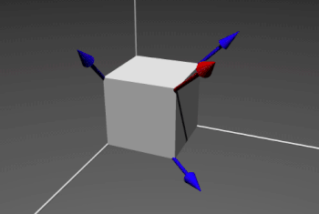
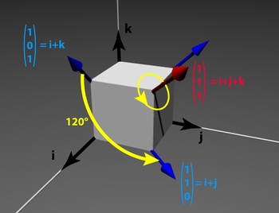

## Geometry(几何)
A rigid body system is an assembly of different parts which are joints, rigid bodies and forces. A joint connects two different bodies and gather all kinematic relations between those two bodies, allowing the creation of a relative displacement between the two bodies. This displacement is described by breaking it down into three parts: rotations, translations or the compositions of a rotation and a translation.
刚体系统是由不同部件组成的装配体，这些部件包括关节、刚体和力。关节连接两个不同的物体，并汇集这两个物体之间的所有运动学关系，从而允许在两个物体之间产生相对位移。这种位移通过分解为三个部分来描述：旋转、平移或旋转与平移的组合。

Rotation matrices form the so-called Special Orthogonal group $SO(n)$. There are two groups within the latter which interest us as for now: $SO(2)$ and $SO(3)$. $SO(3)$ is the group of all rotations in the 3-dimensionnal space. Its elements are matrices of size 3 by 3. $SO(2)$ is useful for planar problems. It is the group of rotations in the 2-dimensionnal space. Its elements are matrices of size 2 by 2.
旋转矩阵构成了所谓的特殊正交群 $SO(n)$ 。其中目前我们关注的有两个群： $SO(2)$ 和 $SO(3)$ 。 $SO(3)$ 是三维空间中所有旋转构成的群，其元素是 3×3 矩阵。 $SO(2)$ 适用于平面问题，它是二维空间中的旋转群，其元素是 2×2 矩阵。

The set that brings together all the homogeneous transformations matrices is the Special Euclidean group $SE(n)$. As with rotation matrices, there are two different groups, $SE(3)$ for 3-dimensional transformations and $SE(2)$ for 2-dimensional transformations, i.e. transformations in a plane.
将所有齐次变换矩阵汇集在一起的集合是特殊欧几里得群 $SE(n)$ 。与旋转矩阵类似，存在两种不同的群：用于三维变换的 $SE(3)$ 和用于二维变换（即平面内的变换）的 $SE(2)$ 。

### Using quaternions for an SO(3) object
### 对 SO(3)对象使用四元数
To use quaternions for a $SO(3)$ object we have several methods, we can do as in the $SE(3)$ example in the [Dealing with Lie group geometry](https://gepettoweb.laas.fr/doc/stack-of-tasks/pinocchio/master/doxygen-html/md_doc_a-features_e-lie.html) section by removing the translation vector.
若要对 $SO(3)$ 对象使用四元数，我们有多种方法：可以参照"处理李群几何"章节中的 $SE(3)$ 示例，通过移除平移向量来实现。

Or we can just consider one rotation instead of two. For example, in a landmark link to the robot itself, we consider the starting position as the origin of this landmark.
或者我们可以只考虑单个旋转而非两个旋转。例如，在机器人自身坐标系中建立地标时，我们将起始位置视作该坐标系的原点。

So let's consider a cube in the 3-dimensional space.
那么我们来考虑三维空间中的一个立方体。

    

    

<!-- TODO: fix this -->
We want to determine the image of a vector v→ by a 120° rotation ( 2π3) around the big diagonal of the cube, let's call it r→. We have to use a passage through quaternion. We have v→=i→+k→=⎛⎝⎜101⎞⎠⎟ and r→=i→+j→+k→=⎛⎝⎜111⎞⎠⎟
我们想要确定向量 v→ 经过一个 120° 旋转（ 2π3) 绕立方体主对角线，我们称之为 r→ ）后的像。我们需要使用四元数方法。我们有 v→=i→+k→=⎛⎝⎜101⎞⎠⎟ 和 r→=i→+j→+k→=⎛⎝⎜111⎞⎠⎟

我们计算对应的四元数：
We compute the corresponding quaternion:

q=cos(α/2)+sin(α/2)∗r→||r→||

因此我们得到:
Therefore we have:

q=12+12∗(i→+j→+k→)

因此，我们可以使用以下公式计算向量 v→ 的像：
And so we can compute the image of vector v→ using:

v′→=q∗v→∗q−1

我们有:
we have:

v′→=i→+j→=⎛⎝⎜110⎞⎠⎟

### Benefits of using quaternions
Determining the matrix corresponding to a rotation is not immediate, so that very often the physical problem is defined by the couple (α,r→). Another problem related to the composition of rotations is known as "Gimbal lock" : we can see it in specific cases, for example when two successive joints have close or even aligned axes of rotation. In this case, a very large variation of the first angle does not change the position of the end of the device. A robot could then generate very strong violent movements without realizing it, due to the approximation of the calculations. To remedy these two points, we use quaternions.

### Cartesian product
Of course the cartesian product is essential for analysis and description of the movement in our Euclidean space. But here, it's specific to the Lie algebra, this is different from the cartesian product which define our space. The cartesian product can also be used to create a specific space by associating spaces related to the Lie algebra as SE(n) and SO(n) groups.

For example let's consider a wheeled robot like Tiago. It can only move on the ground. It is possible to assimilate the ground to a plane. The robot can rotate around the z-axis so we have to deal with a SE(2) object. Then we attach to this SE(2) object an articulated arm with four revolute joints spread out his arm, each has one degree of freedom of rotation so they are SO(2) objects. To deal with this set we use the cartesian product related to the Lie algebra and we get a new space in which we are able to represent all the possible trajectories of the robot and its arm.

### Vector space
If you want to create a tangent space to simplify calculations of a trajectory, it is necessary to use vector spaces. Indeed, a tangent space is a vector space that is the set of all velocity vectors. Let's consider an object having a trajectory, all points of it have a velocity which is tangent to the trajectory and the space associate to one velocity and passing by one point of the trajectory is the tangent space.

Furthermore, by using vector spaces we have the possibility to use its properties as those of the Euclidean cross operator and linear combinations. However it is important to know that "vector space" is here related to Lie algebra and this is different for a vector space we used to deal with.

## Kinematics
## Dynamics