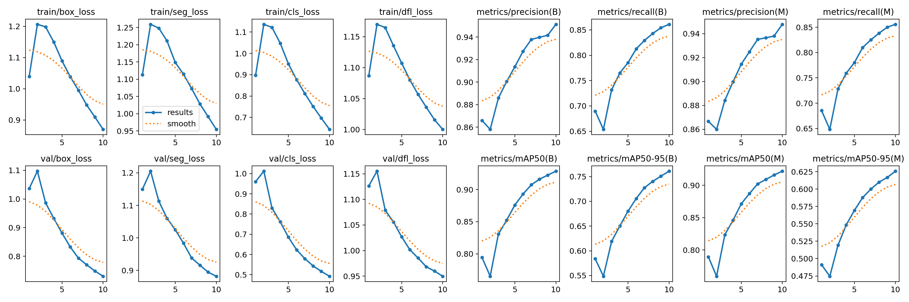
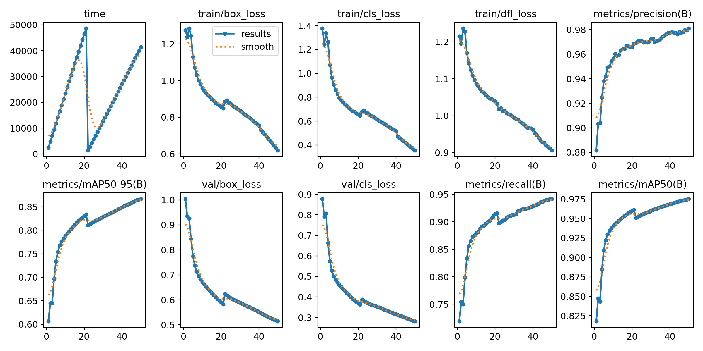

### ReadMe.md

for yolo, command:

```
conda create -n AIdefense python=3.10.14
conda activate AIdefense
```

for mmdetr, command:

conda create -n AIdefense python=3.7.11

### timeline

* 24-10-14-1:30 更改输出格式从numpy.float32到float，分数提高至30+分(使用yolov8n-seg, train_set [10000:], test_set[:,10000], epoch = 10)
* 24-10-14-2:14 更改使用的模型为yolov8m-seg.pt, epochs=30,imgsz=512, 目前看起来一切都好
* 24-10-14-9:00 提交了昨晚的训练结果，训练成绩是50+分
* 
* 24-10-14-9:15 继续使用上一个yolov8m-seg.pt的训练结果继续训练，又训练了10个epoch，使用的代码如下，但是这个训练只是加载了之前的参数作为初始模型，并没有加载原来的梯度信息，所以下一个训练其实花了比较久的时间恢复
  但是我其实比较疑惑的是为什么初始时候的各项分数也都全面降低了，就是下降的速度和原来不是很一致可以理解，但是不理解为什么分数绝对值有下降

  ```
  model = YOLO("./runs/segment/train5/weights/best.pt")
  results = model.train(data=os.path.join(yolo_seg_dataset_path, "data.yaml"), epochs=30, imgsz=512)
  ```
* 24-10-14-11:15
* 
* 24-10-14-11:42 使用training_data2的数据继续进行训练50个epoch，得到的最好的训练结果存储在train9中
* 
* 24-10-14-15:12 得到了训练结果，现在的训练结果如上图所示，仍然没有过拟合，目前分数提升到了61.2608分
* 在上次训练的时候，model=yolov8m-seg.pt，epochs=50，imgsz=512，用了6万数据，一个单个的train_set，训练一个epoch用的显存是7.58G，时间是(7+1)min，所以一个epoch的时间大致为8min，这次打算训到明天早上8点左右，所以大致有123.75个epoch的时间
* 这次训练打算训练training_data3的数据
* 2014-10-23 目前使用了YOLO11-x用于detection任务，使用了第1，2个数据集的数据进行训练，数据集中提取了20000张图片作为测试集，训练效果如下所示
* 
* 最后还是打算用mmdetection的套件，用DETR

### Other Suggestions

* 有人建议了替换YOLO的bakcbone，neck和head网络的方法
* 使用SAM或者DINO来作为YOLO的backbone，但是推理时间还要再确定，看一看是用fast-sam还是什么
* 不使用ultralytics的而是原版的YOLO
* 把YOLO的书继续看，然后把涨点小技巧再跑一跑
* 使用mmdetection的代码库
* 在PaperwithCode上查了一下COCO数据集MAP最高的模型，查到了是Co-DETR，想要部署一下Co-DETR用于训练
* why to use -seg net, why can't i use no seg , just detection model
* 现在想就是把YOLO给做好，把YOLO的各个提点的分数给跑起来就行
